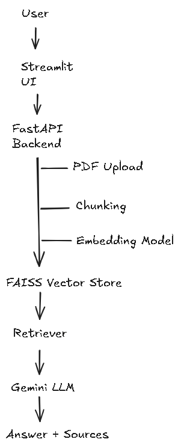
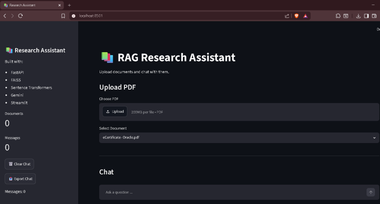
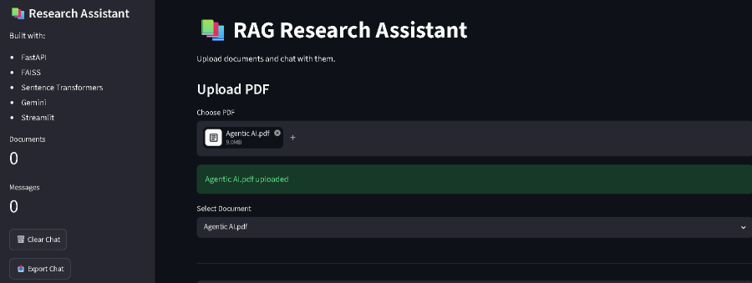
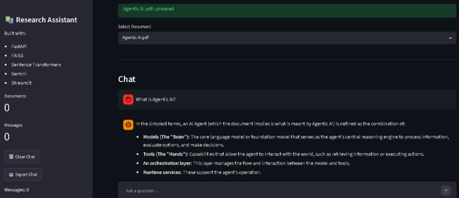
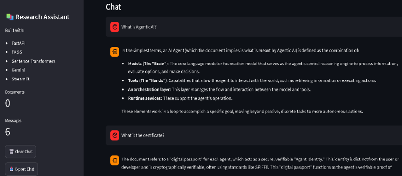

# 📚 Research Assistant RAG 

Retrieval-Augmented Generation (RAG) powered document question-answering system built with FastAPI, FAISS, Sentence Transformers, Gemini, and Streamlit.
---

## ✨ Features

✅ PDF Upload & Processing
✅ Automatic Text Extraction
✅ Smart Text Chunking
✅ Semantic Search with FAISS
✅ Retrieval-Augmented Generation (RAG)
✅ Multi-Document Search
✅ Conversational Memory
✅ Source Attribution
✅ Confidence Scoring
✅ Chat Export
✅ Interactive Streamlit Frontend

---

## 🛠️ Tech Stack

* 🐍 Python
* ⚡ FastAPI
* 🎨 Streamlit
* 🔍 FAISS
* 🤗 Sentence Transformers
* 🤖 Gemini API

---

## 🏗️ Architecture



---

## 📸 Screenshots

### 🏠 Home Page



### 📄 Upload PDF



### ❓ Ask Questions



### 💬 Chat History



---

## 📂 Project Structure

```text
research-assistant/
│
├── app/
│   ├── services/
│   └── utils/
│
├── ui/
│   └── streamlit_app.py
│
├── uploads/
├── data/
├── vectorstore/
│
├── tests/
├── main.py
├── requirements.txt
└── README.md
```

---

## 🚀 How It Works

1. Upload one or more PDF documents.
2. Extract text and split it into chunks.
3. Generate embeddings using Sentence Transformers.
4. Store embeddings in a FAISS vector index.
5. Retrieve relevant chunks based on user queries.
6. Use Gemini to generate context-aware answers.
7. Display answers with confidence scores and sources.

---

## 🎯 Key Capabilities

* Semantic document search
* Retrieval-Augmented Generation (RAG)
* Multi-document retrieval
* Conversational memory
* Source inspection
* Confidence scoring
* Chat export functionality

---

## 🔮 Future Improvements

* Hybrid Search (FAISS + BM25)
* Document Deletion & Re-indexing
* User Authentication
* Cloud Deployment
* Advanced Reranking
* Persistent Chat Storage

---
